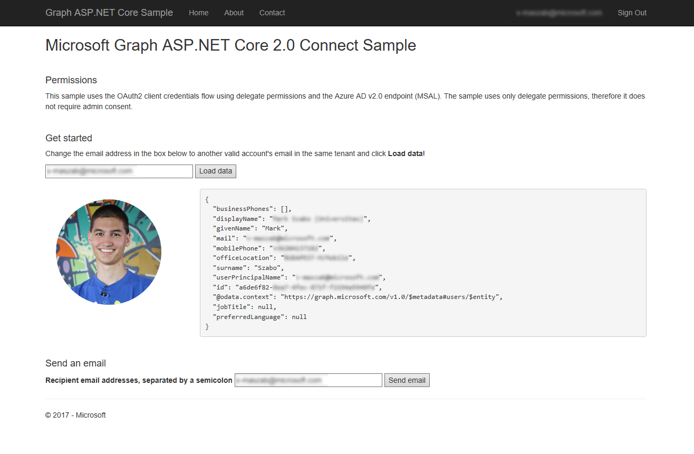

# Microsoft Graph Webhooks Sample for ASP.NET Core 2.0

## Table of contents

* [Prerequisites](#prerequisites)
* [Register the app](#register-the-app)
* [Configure and run the sample](#configure-and-run-the-sample)
* [Key components of the sample](#key-components-of-the-sample)
* [Contributing](#contributing)
* [Questions and comments](#questions-and-comments)
* [Additional resources](#additional-resources)

This ASP.NET Core 2.0 MVC sample shows how to connect to Microsoft Graph using delegate permissions and the Azure AD v2.0 endpoint (MSAL) to retrieve a user's profile and profile picture and send an email that contains the photo as an attachment.  
The sample uses OpenID Connect for sign in, [Microsoft Authentication Library (MSAL) for .NET](https://github.com/AzureAD/microsoft-authentication-library-for-dotnet) to obtain an access token, and the [Microsoft Graph Client Library for .NET](https://github.com/microsoftgraph/msgraph-sdk-dotnet) (SDK) to interact with Microsoft Graph. The MSAL SDK provides features for working with the [Azure AD v2.0 endpoint](https://azure.microsoft.com/en-us/documentation/articles/active-directory-appmodel-v2-overview), which enables developers to write a single code flow that handles authentication for both work or school (Azure Active Directory) and personal (Microsoft) accounts.
The sample uses only delegate permissions, therefore it does not require admin consent.

>If you are searching the ASP.NET Core 1.1 version of this sample, you can find it [here](https://github.com/microsoftgraph/aspnetcore-connect-sample/tree/netcore1.1).

## Using the Microsoft Graph Connect Sample

The screenshot below shows the app's start page.
  

## Important note about the MSAL Preview

This library is suitable for use in a production environment. We provide the same production level support for this library as we do our current production libraries. During the preview we may make changes to the API, internal cache format, and other mechanisms of this library, which you will be required to take along with bug fixes or feature improvements. This may impact your application. For instance, a change to the cache format may impact your users, such as requiring them to sign in again. An API change may require you to update your code. When we provide the General Availability release we will require you to update to the General Availability version within six months, as applications written using a preview version of library may no longer work.

## Prerequisites

To use the Microsoft Graph Connect Sample for ASP.NET Core 2.0, you need the following:

* Visual Studio 2017 [with .NET Core 2.0 SDK](https://www.microsoft.com/net/download/core) installed on your development computer.
* Either a [personal Microsoft account](https://signup.live.com) or a [work or school account](https://dev.office.com/devprogram). (You don't need to be an administrator of the tenant.)
* The application ID and key from the application that you [register on the App Registration Portal](#register-the-app).

## Create the Azure Web App

Webhooks in Microsoft Graph require a publicly accessible endpoint such as a Microsoft Azure Web App or another web server. This lab uses **Microsoft Azure**.

1. In the Microsoft Azure portal, create a new web app by selecting **+ Create a resource > Web + Mobile > Web App**.

1. Provide a unique name, choose the subscription, and provide a resource group.

1. Choose **Windows** as the OS type.

1. Edit the app service plan. Provide the name, location, and change the pricing tier to **Free**.

1. Select **OK** and then select **Create**. Copy the URL for later use.

## Register the app

This app uses the Azure AD v2.0 endpoint, so you'll register it on the [App Registration Portal](https://apps.dev.microsoft.com/).

1. Sign into the portal using either your personal or work or school account.

2. Choose **Add an app** next to 'Converged applications'.

3. Enter a name for the app, and choose **Create application**. (Don't check the Guided Setup box.)

   a. Enter a friendly name for the application.

   b. Copy the **Application Id**. This is the unique identifier for your app.

   c. Under **Application Secrets**, choose **Generate New Password**. Copy the password from the dialog. You won't be able to access this value again after you leave this dialog.

   >**Important**: Note that in production apps you should always use certificates as your application secrets, but for this sample we will use a simple shared secret password.

   d. Under **Platforms**, choose **Add platform**.

   e. Choose **Web**.

   f. Make sure the **Allow Implicit Flow** check box is selected, and add  Microsoft Azure Web App (ex: https://YOURWEBAPP.azurewebsites.net/) as a **Redirect URL**. This is the base callback URL for this sample.
   
   >The **Allow Implicit Flow** option enables the hybrid flow. During authentication, this enables the app to receive both sign-in info (the id_token) and artifacts (in this case, an authorization code) that the app can use to obtain an access token.

   g. Enter `https://YOURWEBAPP.azurewebsites.net/Account/SignOut` as the **Logout URL**.
  
   h. Click **Save**.

   >You'll use the application ID and secret to configure the app in Visual Studio.

4. Configure Permissions for your application. **(Optional)**

   >Note that we are not required to add permissions for reading user data and sending emails during the app registration as you would do with the [v1 endpoint (ADAL)](https://docs.microsoft.com/en-us/azure/active-directory/develop/active-directory-integrating-applications). The [Incremental and dynamic consent](https://docs.microsoft.com/en-us/azure/active-directory/develop/active-directory-v2-compare#incremental-and-dynamic-consent) capability of the v2 endpoint (MSAL) has made this step optional.

   a. Choose **Microsoft Graph Permissions** > **Delegated Permissions** > **Add**.
  
   b. Select **openid**, **email**, **profile**, **offline_access**, **User.Read**, **User.ReadBasic.All** and **Mail.Send**. Then click **Ok**.
  
   c. Click **Save**.

## Configure and run the sample

1. Download or clone the Microsoft Graph Connect Sample for ASP.NET Core.

2. Open the **MicrosoftGraphAspNetCoreConnectSample.sln** sample file in Visual Studio 2017.

3. In Solution Explorer, open the **appsettings.json** file in the root directory of the project.  

   a. For the **ClientId** key, replace `ENTER_YOUR_APP_ID` with the application ID of your registered application.  

   b. For the **ClientSecret** key, replace `ENTER_YOUR_SECRET` with the password of your registered application. Note that in production apps you should always use certificates as your application secrets, but for this sample we will use a simple shared secret password.  
   
   c. For the **NotificationUrl**, replace "ENTER_YOUR_NOTIFYURL" with the Microsoft Azure Web App (ex: https://YOURWEBAPP.azurewebsites.net/).
   
   d. For the **BaseUrl**, replace "ENTER_YOUR_APP_URL" with the Microsoft Azure Web App (ex: https://YOURWEBAPP.azurewebsites.net/)

1. Right-click the project node in **Visual Studio 2017**, choose **Publish**.

1. Choose **Microsoft Azure App Service**.

1. Choose **Select Existing**, and choose **OK**.

1. Choose your newly created web app and select **OK**.

1. Microsoft Azure web apps makes it easy to debug a web application in the cloud as if it were running locally. In the Publish screen, click **Settings**, then click the **Settings** tab, and change the configuration from **Release** to **Debug**.

1. Select **Save**.

1. In the publish screen, select **Publish**.

1. In the new browser window, select the **Sign in with Microsoft** link in the top right of the window. When prompted, grant consent to the requested permissions. Once logged in, the navigation menu will reflect the changes made to the application.
1. Select Subscribe in the menu. This will initiate a new subscription to your mailbox, and will show the subscription properties when complete.
1. The subscription was created for mail messages, any time a new message is created in your inbox in the next 15 minutes (the lifetime of the subscription request) a notification is received. To see this, select the Send mail menu item. Enter your email address, a subject and body, and select Send.
 >**Note:** Your application could provide additional capabilities such as querying Microsoft Graph for additional data when a notification is received. This application allows multiple users to add subscriptions, but all users can see all notifications. Your application may require you to implement a per-user information store or filter data to only the notifications relevant to the current user.

## Key components of the sample

The following files contain code that's related to connecting to Microsoft Graph, loading user data and sending emails.

* [`appsettings.json`](MicrosoftGraphAspNetCoreConnectSample/appsettings.json) Contains values used for authentication and authorization. 
* [`Startup.cs`](MicrosoftGraphAspNetCoreConnectSample/Startup.cs) Configures the app and the services it uses, including authentication.
* [`GraphAuthProvider.cs`](MicrosoftGraphAspNetCoreConnectSample/Helpers/GraphAuthProvider.cs) Gets an access token using MSAL's **AcquireTokenSilentAsync** method.
* [`GraphSdkHelper.cs`](MicrosoftGraphAspNetCoreConnectSample/Helpers/GraphSDKHelper.cs) Initiates the SDK client used to interact with Microsoft Graph.
* [`GraphService.cs`](MicrosoftGraphAspNetCoreConnectSample/Helpers/GraphService.cs) Contains methods that use the **GraphServiceClient** to build and send calls to the Microsoft Graph service and to process the response.
  * The **GetUserJson** action gets the user's profile by an email adress and converts it to JSON.
  * The **GetPictureBase64** action gets the user's profile picture and converts it to a base64 string.
  * The **SendEmail** action sends an email on behalf of the current user.
* [`SessionTokenCache.cs`](MicrosoftGraphAspNetCoreConnectSample/Helpers/SessionTokenCache.cs) Sample implementation of an in-memory token cache. Production apps will typically use some method of persistent storage.

## Additional resources

* [Microsoft Graph documentation](https://developer.microsoft.com/graph)
* [Other Microsoft Graph Connect samples](https://github.com/MicrosoftGraph?q=connect)
* [Microsoft Graph Webhooks Sample for ASP.NET Core](https://github.com/microsoftgraph/aspnetcore-apponlytoken-webhooks-sample)
* [Microsoft Graph Connect Sample for ASP.NET 4.6](https://github.com/microsoftgraph/aspnet-connect-sample)

## Copyright

Copyright (c) 2018 Microsoft. All rights reserved.
